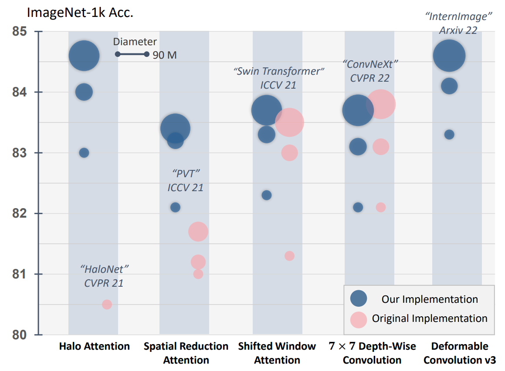

# [Demystify Transformers & Convolutions in Modern Image Deep Networks](https://arxiv.org/abs/2211.05781)

This repository is a codebase for modern image deep networks, which is used in our paper ["Demystify Transformers & Convolutions in Modern Image Deep Networks"](https://arxiv.org/abs/2211.05781). In this paper, we develop a unified architecture for different spatial token mixing paradigms, and make various comparisons and analyses for these "spatial token mixers". 

 

## The Purpose of This Project
 Recently, a series of transformer-based vision backbones with novel spatial feature aggregation paradigms (spatial token mixer, STM) are proposed and report remarkable performance. However, network engineering techniques can also improve their performance significantly. Some works also argue simple STM can attain competitive performance with proper design. Hence, we aim to identify the real difference and performance gains among different STMs under a unified and optimized overall design (architecture and training recipes). Hence, we elaborate a unified architecture, upon which a series of STMs are fit into it for comparisons and analyses.

## Currently Supported STMs
+ **Halo Attention**, a local attention STM from [HaloNet](https://openaccess.thecvf.com/content/CVPR2021/html/Vaswani_Scaling_Local_Self-Attention_for_Parameter_Efficient_Visual_Backbones_CVPR_2021_paper.html).
+ **Spatial Reduction Attention**, a global attention STM from [PVT](https://github.com/whai362/PVT).
+ **Shifted Window Attention**, a local attention STM from [Swin Transformer](https://github.com/microsoft/Swin-Transformer).
+ **Depth-Wise Convolution**, which has been proven to be a simple yet effective STM by [ConvNeXt](https://github.com/facebookresearch/ConvNeXt).
+ **Deformable Convolution v3** (DCNv3, to be added), which is a recent dynamic convolution operator used in [InternImage](https://github.com/OpenGVLab/InternImage).


## Updates
+ [2024.10.06] The code and checkpoints for Unified-InternImage are released.
+ [2022.12.30] The code for ImageNet-1k classification is released.
+ [2022.12.30] The code for COCO object detection is released.

## Highlights
+ A unified architecture for spatial token mixers, which shows better performance compared with the original implementations.
+ A re-implemented Halo-Attention [(HaloNet)](https://openaccess.thecvf.com/content/CVPR2021/html/Vaswani_Scaling_Local_Self-Attention_for_Parameter_Efficient_Visual_Backbones_CVPR_2021_paper.html) yields strong performance.

## Usage
+ Developing new spatial token mixers.
+ Using the pretrained models for downstream tasks.

## Requirements and Data Preparation
### Installation
We suggest the python 3.8 environments with the following packages:
+ torch>=1.7.0; torchvision>=0.8.0 (Follow [official guide](https://pytorch.org/) to install PyTorch, GPU version recommended)
+ pytorch-image-models (`pip install timm=0.6.7`)
+ pyyaml (`pip install pyyaml`)
+ opencv-python (`pip install opencv-python`)
Packages with different versions may also work. We only test the aforementioned version.

If you want to use the U-InternImage, please install the MultiScaleDeformableAttention:

```shell
cd ./classification/ops
sh make.sh
```

### Data Preparation
ImageNet with the following folder structure, and you can extract ImageNet by this [script](https://gist.github.com/BIGBALLON/8a71d225eff18d88e469e6ea9b39cef4).

```
│imagenet/
├──meta/
|  ├──train.txt
│  ├──val.txt
├──train/
│  ├── n01440764
│  │   ├── n01440764_10026.JPEG
│  │   ├── n01440764_10027.JPEG
│  │   ├── ......
│  ├── ......
├──val/
│  ├── n01440764
│  │   ├── ILSVRC2012_val_00000293.JPEG
│  │   ├── ILSVRC2012_val_00002138.JPEG
│  │   ├── ......
│  ├── ......
```

## Using Pretrained Models
You can refer to the ``models`` folder to create any stand-alone models, and then load them with the pre-trained weights. All the pre-trained weights can be found here.

### All models
|               |                                                         U-HaloNet                                                         |                                                       U-PVT                                                       | U-Swin Transformer                                                                                                 | U-ConvNeXt                                                                                                             | U-InternImage                                                                                                                 |
| :-----------: | :-----------------------------------------------------------------------------------------------------------------------: | :---------------------------------------------------------------------------------------------------------------: | ------------------------------------------------------------------------------------------------------------------ | ---------------------------------------------------------------------------------------------------------------------- | ----------------------------------------------------------------------------------------------------------------------------- |
| Micro (~4.5M) | **75.8%** \| [Download](https://github.com/OpenGVLab/STM-Evaluation/releases/download/cls-ckpt/unified_halonet_micro.pth) | 72.8% \| [Download](https://github.com/OpenGVLab/STM-Evaluation/releases/download/cls-ckpt/unified_pvt_micro.pth) | 74.4% \| [Download](https://github.com/OpenGVLab/STM-Evaluation/releases/download/cls-ckpt/unified_swin_micro.pth) | 75.1% \| [Download](https://github.com/OpenGVLab/STM-Evaluation/releases/download/cls-ckpt/unified_convnext_micro.pth) | 75.3% \| [Download](https://github.com/OpenGVLab/STM-Evaluation/releases/download/cls-ckpt/unified_internimage_micro.pth)     |
|  Tiny (~30M)  |   83.0% \| [Download](https://github.com/OpenGVLab/STM-Evaluation/releases/download/cls-ckpt/unified_halonet_tiny.pth)    | 82.1% \| [Download](https://github.com/OpenGVLab/STM-Evaluation/releases/download/cls-ckpt/unified_pvt_tiny.pth)  | 82.3% \| [Download](https://github.com/OpenGVLab/STM-Evaluation/releases/download/cls-ckpt/unified_swin_tiny.pth)  | 82.2% \| [Download](https://github.com/OpenGVLab/STM-Evaluation/releases/download/cls-ckpt/unified_convnext_tiny.pth)  | **83.3%** \| [Download](https://github.com/OpenGVLab/STM-Evaluation/releases/download/cls-ckpt/unified_internimage_tiny.pth)  |
| Small (~50M)  |   84.0% \| [Download](https://github.com/OpenGVLab/STM-Evaluation/releases/download/cls-ckpt/unified_halonet_small.pth)   | 83.2% \| [Download](https://github.com/OpenGVLab/STM-Evaluation/releases/download/cls-ckpt/unified_pvt_small.pth) | 83.3% \| [Download](https://github.com/OpenGVLab/STM-Evaluation/releases/download/cls-ckpt/unified_swin_small.pth) | 83.1% \| [Download](https://github.com/OpenGVLab/STM-Evaluation/releases/download/cls-ckpt/unified_convnext_small.pth) | **84.1%** \| [Download](https://github.com/OpenGVLab/STM-Evaluation/releases/download/cls-ckpt/unified_internimage_small.pth) |
| Base (~100M)  | **84.6%** \| [Download](https://github.com/OpenGVLab/STM-Evaluation/releases/download/cls-ckpt/unified_halonet_base.pth)  | 83.4% \| [Download](https://github.com/OpenGVLab/STM-Evaluation/releases/download/cls-ckpt/unified_pvt_base.pth)  | 83.7% \| [Download](https://github.com/OpenGVLab/STM-Evaluation/releases/download/cls-ckpt/unified_swin_base.pth)  | 83.7% \| [Download](https://github.com/OpenGVLab/STM-Evaluation/releases/download/cls-ckpt/unified_convnext_base.pth)  | 84.5% \| [Download](https://github.com/OpenGVLab/STM-Evaluation/releases/download/cls-ckpt/unified_internimage_base.pth)      |

<!--
The detailed complexity and accuracy of each model are listed below. Note that the original accuracy denotes the reported accuracy of their official paper and implementation. We fit their spatial token mixers into our unified architecture.


### HaloNet
| Scale | #Params (M) | GMACs | Acc. (Our Implementation) | Acc. (Original) |   Checkpoint   |
| :---: | :---------: | :---: | :-----------------------: | :-------------: | :------------: |
| Micro |     4.4     | 0.71  |           74.4            |       --        | [Download](xx) |
| Tiny  |    31.5     | 4.91  |           82.3            |                 | [Download](xx) |
| Small |    52.9     | 9.18  |           83.3            |                 | [Download](xx) |
| Base  |    93.4     | 16.18 |           83.7            |                 | [Download](xx) |

### PVT
| Scale | #Params (M) | GMACs | Acc. (Our Implementation) | Acc. (Original) |   Checkpoint   |
| :---: | :---------: | :---: | :-----------------------: | :-------------: | :------------: |
| Micro |     4.4     | 0.71  |           74.4            |       --        | [Download](xx) |
| Tiny  |    31.5     | 4.91  |           82.3            |                 | [Download](xx) |
| Small |    52.9     | 9.18  |           83.3            |                 | [Download](xx) |
| Base  |    93.4     | 16.18 |           83.7            |                 | [Download](xx) |

### Swin Transformer
| Scale | #Params (M) | GMACs | Acc. (Our Implementation) | Acc. (Original) |   Checkpoint   |
| :---: | :---------: | :---: | :-----------------------: | :-------------: | :------------: |
| Micro |     4.4     | 0.71  |           74.4            |       --        | [Download](xx) |
| Tiny  |    31.5     | 4.91  |           82.3            |                 | [Download](xx) |
| Small |    52.9     | 9.18  |           83.3            |                 | [Download](xx) |
| Base  |    93.4     | 16.18 |           83.7            |                 | [Download](xx) |

### ConvNeXt
| Scale | #Params (M) | GMACs | Acc. (Our Implementation) | Acc. (Original) |   Checkpoint   |
| :---: | :---------: | :---: | :-----------------------: | :-------------: | :------------: |
| Micro |     4.4     | 0.71  |           74.4            |       --        | [Download](xx) |
| Tiny  |    31.5     | 4.91  |           82.3            |                 | [Download](xx) |
| Small |    52.9     | 9.18  |           83.3            |                 | [Download](xx) |
| Base  |    93.4     | 16.18 |           83.7            |                 | [Download](xx) |

### InternImage
| Scale | #Params (M) | GMACs | Acc. (Our Implementation) | Acc. (Original) |   Checkpoint   |
| :---: | :---------: | :---: | :-----------------------: | :-------------: | :------------: |
| Micro |     4.4     | 0.71  |           74.4            |       --        | [Download](xx) |
| Tiny  |    31.5     | 4.91  |           82.3            |                 | [Download](xx) |
| Small |    52.9     | 9.18  |           83.3            |                 | [Download](xx) |
| Base  |    93.4     | 16.18 |           83.7            |                 | [Download](xx) |
-->


## Evaluation of Classification Models
You can use the shell scripts in `shell/eval` to evaluate the model. The provided code works with slurm. If you are using a slurm-supported cluster to run the model, please modify the **virtual partition** and **checkpoint path**. For example, to evaluate HaloNet-Tiny on ImageNet-1k, you use the following command:
```
cd ./classification
sh ./shell/eval/eval.sh $MODEL_NAME$
```
The `$MODEL_NAME$` for different models are listed as follows:
|               |     U-HaloNet      |       U-PVT       | U-Swin Transformer | U-ConvNeXt             | U-InternImage        |
| :-----------: | :----------------: | :---------------: | ------------------ | ---------------------- | -------------------- |
| Micro (~4.5M) | unified_halo_micro | unified_pvt_micro | unified_swin_micro | unified_convnext_micro | unified_dcn_v3_micro |
|  Tiny (~30M)  | unified_halo_tiny  | unified_pvt_tiny  | unified_swin_tiny  | unified_convnext_tiny  | unified_dcn_v3_tiny  |
| Small (~50M)  | unified_halo_small | unified_pvt_small | unified_swin_small | unified_convnext_small | unified_dcn_v3_small |
| Base (~100M)  | unified_halo_base  | unified_pvt_base  | unified_swin_base  | unified_convnext_base  | unified_dcn_v3_base  |

## Training Classification Models
Currently, this repository only supports ImageNet-1k training. ImageNet-21k training will be updated soon. You can use the shell scripts in ```shell/1k_pretrain``` to reproduce our results. For example, if you want to train HaloNet-Tiny, you can use the following command:
```
cd ./classification
sh ./shell/1k_pretrain/transformer.sh $MODEL_NAME$
```
Remember to modify the output directory and the virtual partition. The scripts also work with slurm, you can use PyTorch official DDP mechanism to launch the training with some modifications, refer to [ConvNeXt](https://github.com/facebookresearch/ConvNeXt) for details.


## Training and Evaluation on Object Detection
Plese refer this [guide](detection/readme.md) the train and evaluate the models on object detection. 

## Bibtex
If you find our work or models useful, please consider citing our paper as follows:
```
@article{hu2022demystify,
  title={Demystify Transformers \& Convolutions in Modern Image Deep Networks},
  author={Hu, Xiaowei and Shi, Min and Wang, Weiyun and Wu, Sitong and Xing, Linjie and Wang, Wenhai and Zhu, Xizhou and Lu, Lewei and Zhou, Jie and Wang, Xiaogang and Qiao, Yu and Dai, Jifeng},
  journal={arXiv preprint arXiv:2211.05781},
  year={2022}
}
```

## Acknowledgment
+ A large part of our code is borrowed from Timm library ([pytorch-image-models](https://github.com/rwightman/pytorch-image-models)) and DeiT implementation ([code](https://github.com/facebookresearch/deit)).
+ We partly refer to the unofficial HaloNet implementation of timm lib ([code](https://github.com/rwightman/pytorch-image-models)) and lucidrains ([code](https://github.com/lucidrains/halonet-pytorch)) when re-producing Halo-attention.
